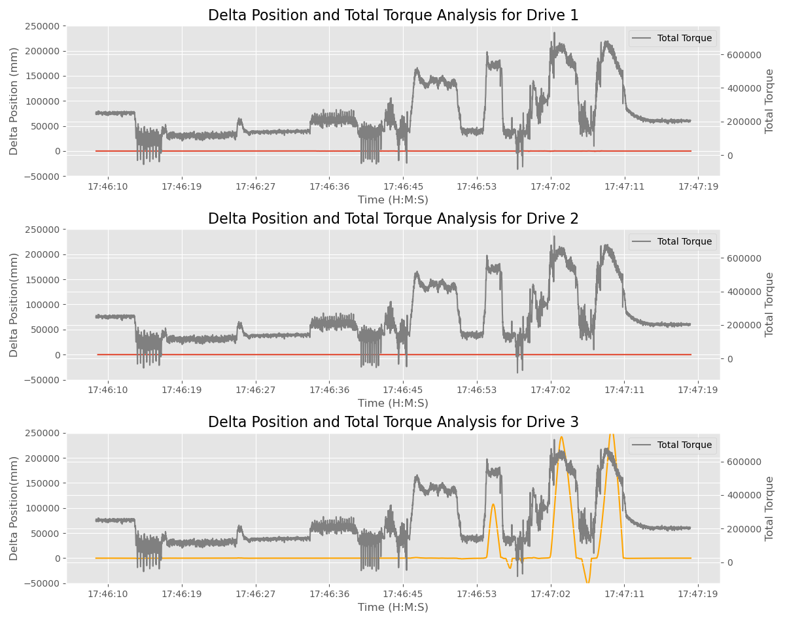

# Motion Profile Analysis

## Background

The client is claiming that combined moves under load are not functioning as they expect. They have not disclosed their application or exact use case but have provided us with raw CAN logs for analysis. 

## Analysis

After analysis we can see that they are having issues with Drive #3 when loaded based on the CAN logs provided. Drives 1 & 2 are both correctly matching the expected position and speed but we can see that Drive 3 is not. Plotting the difference between expected vs. actual drive position as well as total torque from all drives we can see that the issues on Drive 3 are correllated with total torque. 

## Conclusion

From this analysis we can conclude that the customer is experiencing issues with Drive #3 when total system torque exceeds 400000 (units unclear). The maximum output torque of the system should be referenced and if 400000 is above the specification then the customer should be notified that they are not using the product within its specifications.

